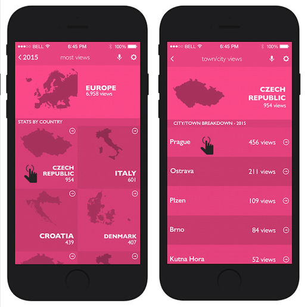

# Covid-19 Tracking App

## About

Covid-19 Tracking App is a React & Redux application which users can display filtered global covid-19 data as country and date based.

[](https://relaxed-elion-3dcb57.netlify.app/)

Development flow included: performing git-flow practices & using components with routers, life cycle methods, handling events and state management by Redux store, actions, reducers with asynchronous actions in [duck Pattern](https://github.com/erikras/ducks-modular-redux) including unit and component tests.

## Design

Original design is belongs to: [Nelson Sakwa on Behance](https://www.behance.net/sakwadesignstudio).



## Built With

- Javascript
- React & Redux
- Redux Middleware (Thunk, Logger)
- Bootstrap
- Jest for testing

## Live Demo

[Demo Link](https://loving-lamarr-2cca8c.netlify.app/)

## Getting Started

To get a local copy up and run the app; follow below steps.

### Prerequisites

If you are not familiar to use terminal, please check this [article](https://www.theodinproject.com/courses/web-development-101/lessons/command-line-basics-web-development-101)

### Setup

Open your terminal and run the following commands on your terminal.

Make sure 'Javascript' is not blocked in your browser.

### Install

To get a local copy of the repository, run the following commands on your terminal.

```
cd <your_desktop>
```

```
git clone https://github.com/yigitm/covid-19-tracking-app
```

```
cd covid-19-tracking-app
```

### Usage

To install the necessary Javascript packages to your project, run below commands.

```
npm install
```

To run the app, use below command.

```
npm start
```

It runs the app in the development mode and runs the app in [http://localhost:3000](http://localhost:3000).To view it open your default browser.

### Run tests

To run the tests, use below command.

```
npm run test
```

Launches the test runner in the interactive watch mode.\
See the section about [running tests](https://facebook.github.io/create-react-app/docs/running-tests) for more information.

### Deployment

[Netlify](https://www.netlify.com/) is used for deployment.

## Authors

👤 **Yigit Mersin**

- GitHub: [@github](https://github.com/ygtmrsn)
- LinkedIn: [@linkedIn](linkedin.com/in/yigitmersin)
- Twitter: [@twitter](https://twitter.com/ygtmrsn)

## 🤝 Contributing

Contributions, issues, and feature requests are welcome!

Feel free to check the [issues page](https://github.com/yigitm/covid-19-tracking-app/issues).

## Show your support

Give a ⭐️ if you like this project!

## Acknowledgments

- [Microverse](https://www.microverse.org/)
- [Narrativa API](https://covid19tracking.narrativa.com/index_en.html)
- [Open Source](https://en.wikipedia.org/wiki/Open_source)

## 📝 License

This project is [MIT](./MIT.md) licensed.
